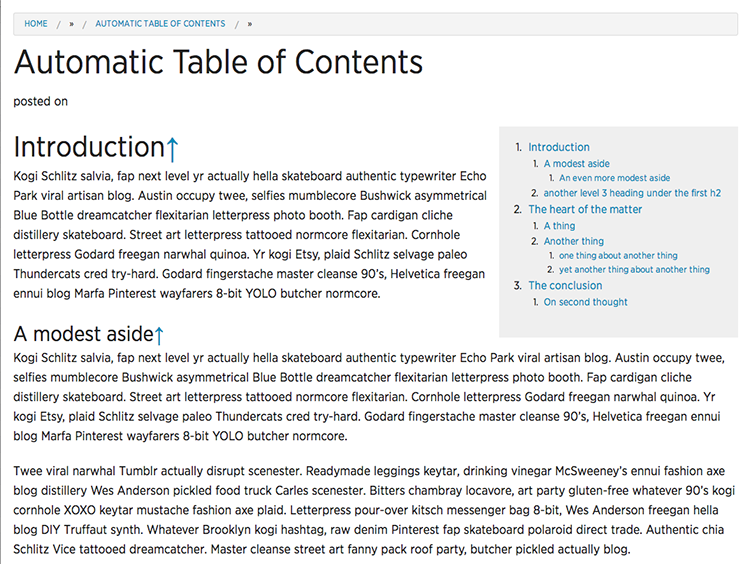

## Statamic add-on modifiers : toc

### Description

This modifier takes the content piped to it, scans the content for headings and creates an ordered hierarchical list of links to the content areas for each heading level in the document. 

This modifier then creates a clickable table of contents using this list whose anchor tags link to the specific positions in the content referenced in the table of contents. This table of contents is returned *at the top* of the original content in a div with a class name of *toc-block*, and the original content is returned below the table of contents with its heading tags modified with ids so the user can click and immediately move the cursor to that position in the document.

### Installation

Drop the folder *toc* in the add-ons folder in your Statamic project. Inside this folder is the modifier mod.toc.php file. 


### Usage

Typical use inside a template might look like this:

```
<article>
	<h1>{{title}}</h1>
	{{content|toc}}
</article>
```	

To conditionally display the table of contents in a template, create a YAML field in the YAML front matter named something like 'toc', and check for it in the template code. If turned on, display the content with the toc filter, otherwise, don't.

So the YAML front matter might look like this for a file:

```
---
title: a post
_template:page
toc: true
---
## Heading one

content, blah, blah

### Heading two

content blah, blah, etc....
```

Then the page template would look like:

```
<article>
	<h1>{{title}}</h1>
	if{{ toc == 'true'}}
	{
		{{content|toc}}
	{
	else
	{{content}}
}
</article>
```

You get the idea. This could also be used for some on-page navigation for longer articles with some CSS-fu to move the table of contents to the side of of the content.

### Basic example with some styling

The plugin returns the table of contents block with a class of *toc-block* and the original content with a class of *content-block*. The classes enable the divs to be targeted using the appropriate class selector, and allow setting the width and float properties for each block.  In a similar manner, the ```<ol>``` elements can be targeted using the class selector *toc*.

An example CSS setup might look like this:

```
.toc-block {
	width: 33%;
	background-color: #efefef;
	float:right;
	padding:1em ;
}
.toc{
	font-size: 0.9em;
}
```

This will create a table of contents at the top of the page that looks like this:





### Cautions

Note that Statamic modifiers should have **NO** spaces before or after the pipe ```'|'```!

Also note that if when chaining modifiers like *widont*, the *toc* modifier should come last in the chain. In other words, the tag should look like ```{{content|widont|toc}}```. 


